# 网上商城

## 软件架构
<table>
<thead>
<tr>
<th>项目版本号</th>
<th>技术架构</th>
</tr>
</thead>
<tbody>

<tr>
<td>一期项目</td>
<td>Spring + SpringMVC + Mybatis + Guava Cache</td>
</tr>
<tr>
<td>二期项目</td>
<td>Spring + SpringMVC + Mybatis + Nginx + vsftp + Redis + Jedis + Lombok + Jackson + Spring Schedule</td>
</tr>

</tbody>
</table>


**系统描述：** 本项目是基于 SSM 框架开发的前后端分离电商网站，数据库采用的是 MySQL。包含用户管理，订单，品类，产品，购物车，地址，在线支付七个模块。项目还融合了 Tomcat 集群，Nginx 负载均衡，Redis 缓存分布式，Redis 分布式锁，单点登录等技术。

### 技术点
1.  前后端分离
2.  搭建Tomcat+Nginx集群环境
3.  搭建Redis分布式环境
4.  Redis+Cookie+Jackson+Filter原生的方式解决集群session共享的问题
5.  项目集成Redis客户端jedis
6.  jackson封装JsonUtil
7.  Cookie封装
8.  SessionExpireFilter重置session有效期
9.  封装Shard Redis API
10. Spring Session框架集成零侵入实现单点登录
11. SpringMVC 全局异常处理
12. SpringMVC 拦截器实现权限统一校验
13. 使用部分RESTful接口
14. 利用蚂蚁金服开放平台沙箱集成支付宝完成真实支付
15. Spring Schedule实现定时关单

## 项目架构图


## 项目功能接口图


## 登录购物演示


## 支付演示


本项目对接了支付宝的'当面付'，即'扫码支付'，通过订单号生成付款二维码，上传FTP服务器，展示给客户扫码成功付款后（通过支付宝沙箱环境模拟支付），收到支付宝回调，商家验证签名正确性，然后进行后续操作

[支付宝官方文档](https://doc.open.alipay.com/docs/doc.htm?spm=a219a.7629140.0.0.Q4tRmQ&treeId=193&articleId=105072&docType=1)<br>
[支付宝沙箱](https://openhome.alipay.com/platform/appDaily.htm?tab=info)<br>

## 业务流程

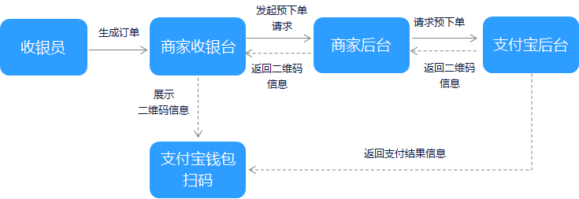

## 调用流程

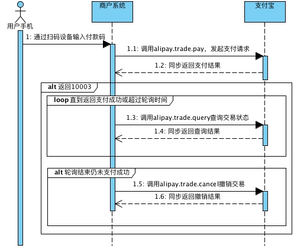

1. 商户系统调用支付宝预下单接口`alipay.trade.precreate`，获得该订单二维码图片地址。

2. 发起轮询获得支付结果：等待`5`秒后调用交易查询接口`alipay.trade.query`通过支付时传入的商户订单号(`out_trade_no`)查询支付结果（返回参数`TRADE_STATUS`），如果仍然返回等待用户付款（`WAIT_BUYER_PAY`），则再次等待5秒后继续查询，直到返回确切的支付结果（成功`TRADE_SUCCESS` 或 已撤销关闭`TRADE_CLOSED`），或是超出轮询时间。在最后一次查询仍然返回等待用户付款的情况下，必须立即调用交易撤销接口`alipay.trade.cancel`将这笔交易撤销，避免用户继续支付。

3. 除了主动轮询，也可以通过接受异步通知获得支付结果，详见扫码异步通知，注意一定要对异步通知做验签，确保通知是支付宝发出的。

## Nginx 配置
- 在nginx配置的 `conf` 文件夹下创建 `vhost` 文件 并在 `conf` 下的 `nginx.conf` 文件中加入 `include vhost/*.conf;`

- nginx.conf文件加载vhost文件夹下面的不同配置文件，这样便于分类配置管理，无需全部写在nginx.conf文件中，导致配置的混乱，不便于维护

### Nginx实现静态资源映射

- vhost下添加image.jiekk.com.conf配置文件

- 验证 `nginx` 的配置文件是否生效 `nginx.exe -t `

- 启动 Nginx `nginx.exe`

- ```
  server {
      listen 80; //监听 80 端口
      autoindex on;
      server_name image.jiekk.com; //当访问这个域名时
      access_log d:/access.log combined;
      index index.html index.htm index.jsp index.php;
      #error_page 404 /404. html;
      if ($query_string ~* ".*[\;'\<\>].*") {
          return 404;
      }
      location ~ /(mmall_fe|mmall_admin_fe)/dist/view/* {
                  deny all;
          }
          location / {
                  root D:\coder\ftpfile\img;
                  add_header Access-Control-Allow-Origin *;
          }
  }
  ```

- 访问 `image.jiekk.com` 时转发到路径 `root D:\coder\ftpfile\img;` 从而实现路径转发

- 修改配置文件后要重启 `nginx` : `nginx.exe -s reload`

- 修改 Window 域名(本地开发，避免走外网的域名解析)，`C:\Windows\System32\drivers\etc\hosts`


### Nginx 负载均衡 http 转发

```
upstream www.happymmall.com{
	 server www.jiekk.com:8080 weight=1;
	 server www.jiekk.com:9080 weight=1;
	 #server 127.0.0.1:8080;
	 #server 127.0.0.1:9080;
}
server {
    listen 80;
    autoindex on;
    server_name www.jiekk.com jiekk.com	;
    access_log d:/access.log combined;
    index index.html index.htm index.jsp index.php;
    #error_page 404 /404. html;
    if ($query_string ~* ".*[\;'\<\>].*") {
        return 404;
    }
    
    location / {
	proxy_pass http://www.jiekk.com;
	add_header Access-Control-Allow-Origin *;
    }
}
```

讲解：当访问 ` www.jiekk.com 或 jiekk.com` 时，会转到`http://www.jiekk.com;` ，然后根据负载均衡到 `upstream www.jiekk.com`(这里我配置了本机的 hosts 文件 当访问 www.jiekk.com 会转发到 127.0.0.1)

### 错误总结

- 路径名要使用英文，否则会报错 500

## 缓存比较

### Guava Cache
- Guava Cache是一个本地缓存，它是线程安全的缓存，与ConcurrentMap相似，但前者增加了更多的元素失效策略，通常都设定为自动回收元素,后者只能显示的移除元素

- GuavaCache提供了三种基本的缓存回收方式：基于容量回收、定时回收和基于引用回收。定时回收有两种：按照写入时间，最早写入的最先回收；按照访问时间，最早访问的最早回收

- 它可以监控加载/命中情况

- Guava Cache是单个应用运行时的本地缓存。它不把数据存放到文件或外部服务器。

注：如果你不需要Cache中的特性，使用ConcurrentHashMap有更好的内存效率——但Cache的大多数特性都很难基于旧有的ConcurrentMap复制，甚至根本不可能做到。

### Guava Cache缓存回收 
- 基于容量的回收（size-based eviction）

 如果要规定缓存项的数目不超过固定值，只需使用CacheBuilder.maximumSize(long)。缓存将尝试回收最近没有使用或总体上很少使用的缓存项。——警告：在缓存项的数目达到限定值之前，缓存就可能进行回收操作——通常来说，这种情况发生在缓存项的数目逼近限定值时。

另外，不同的缓存项有不同的“权重”（weights）——例如，如果你的缓存值，占据完全不同的内存空间，你可以使用CacheBuilder.weigher(Weigher)指定一个权重函数，并且用CacheBuilder.maximumWeight(long)指定最大总重。在权重限定场景中，除了要注意回收也是在重量逼近限定值时就进行了，还要知道重量是在缓存创建时计算的，因此要考虑重量计算的复杂度。

- 定时回收（Timed Eviction）

CacheBuilder提供两种定时回收的方法：

expireAfterAccess(long, TimeUnit)：缓存项在给定时间内没有被读/写访问，则回收。请注意这种缓存的回收顺序和基于大小回收一样。
expireAfterWrite(long, TimeUnit)：缓存项在给定时间内没有被写访问（创建或覆盖），则回收。如果认为缓存数据总是在固定时候后变得陈旧不可用，这种回收方式是可取的。

- 基于引用的回收（Reference-based Eviction）

通过使用弱引用的键、或弱引用的值、或软引用的值，Guava Cache可以把缓存设置为允许垃圾回收：

CacheBuilder.weakKeys()：使用弱引用存储键。当键没有其它（强或软）引用时，缓存项可以被垃圾回收。因为垃圾回收仅依赖恒等式（==），使用弱引用键的缓存用==而不是equals比较键。
CacheBuilder.weakValues()：使用弱引用存储值。当值没有其它（强或软）引用时，缓存项可以被垃圾回收。因为垃圾回收仅依赖恒等式（==），使用弱引用值的缓存用==而不是equals比较值。
CacheBuilder.softValues()：使用软引用存储值。软引用只有在响应内存需要时，才按照全局最近最少使用的顺序回收。考虑到使用软引用的性能影响，我们通常建议使用更有性能预测性的缓存大小限定（见上文，基于容量回收）。使用软引用值的缓存同样用==而不是equals比较值。


### Redis
redis是一个key-value存储系统。和Memcached类似，它支持存储的value类型相对更多，包括string(字符串)、list(链表)、set(集合)、zset(sorted set --有序集合)和hash（哈希类型）；

Redis与MemmCached的区别：redis会周期性的把更新的数据写入磁盘或者把修改操作写入追加的记录文件，并且在此基础上实现了master-slave(主从)同步

Redis是一个分布式缓存系统，具有内存缓存和持久化双重功能，有利于缓存集群的扩展

### Redis持久化策略

RDB（数据快照模式）
定期存储，保存的是数据本身，存储文件是紧凑的，RDB定时备份内存中的数据集。服务器启动的时候，可以从 RDB 文件中恢复数据集。

- 优点

1. 存储的文件是紧凑的
2. 适合用于备份，方便恢复不同版本的数据
3. 适合于容灾恢复，备份文件可以在其他服务器恢复
4. 最大化了Redis的性能，备份的时候启动的是子线程，父进程不需要执行IO操作
5. 数据保存比AOF要快

- 缺点

1. 如果Redis因为没有正确关闭而停止工作是，到上个保存点之间的数据将会丢失
2. 由于需要经常fork子线程来进行备份操作，如果数据量很大的话，fork比较耗时，如果cpu性能不够，服务器可能是卡顿。属于数据量大的时候，一个服务器不要部署多个Redis服务。

AOF（追加模式）
每次修改数据时，同步到硬盘(写操作日志)，保存的是数据的变更记录

- 优点 
1. 使用AOF模式更加的灵活，因为可以有不同的fsync策略 
2. AOF是一个日志追加文件，所有不需要定位，就算断电也没有损坏问题，哪怕文件末尾是一个写到一半的命令，redus-check-aof工具也可以很轻易的修复 
3. 当AOF文件很大的，Redis会自动在后台进行重写。重写是决对安全的，因为Redis是继续往旧的文件里面追加，使用创建当前数据集所需的最小操作集合来创建一个全新的文件，一旦创建完成，Redis就会切换到新文件，开始往新文件进行追加操作 
4. AOF包含一个又一个的操作命令，易于理解和解析

- 缺点

1. 对于同样的数据集，AOF文件通常要大于RDB文件
2. AOF可能比RDB要慢，这取决于fsync策略。通常fsync设置为每秒一次的话性能仍然很高，如果关闭sfync，即使在很高的负载下也和RDB一样快。不过，即使在很大的写负载情况下，RDB还是能提供很好的最大延迟保证
3. AOF通过递增的方式更新数据，而RDB快照是从头开始创建，RDB会更健壮和稳定（所以适用于备份）


注意：如果只希望数据保存在内存中的话，俩种策略都可以关闭，也可以同时开启俩种策略，当Redis重启时，AOF文件会用于重建原始数据


## 一期项目使用 Guava Cache 实现重置密码接口

Guava Cache的实现
```java
public class TokenCache {

    private static Logger logger = LoggerFactory.getLogger(TokenCache.class);

    public static final String TOKEN_PREFIX = "token_";

    //LRU算法
    private static LoadingCache<String,String> localCache = CacheBuilder.newBuilder().initialCapacity(1000).maximumSize(10000).expireAfterAccess(12, TimeUnit.HOURS)
            .build(new CacheLoader<String, String>() {
                //默认的数据加载实现,当调用get取值的时候,如果key没有对应的值,就调用这个方法进行加载.
                @Override
                public String load(String s) throws Exception {
                    return "null";
                }
            });

    public static void setKey(String key,String value){
        localCache.put(key,value);
    }

    public static String getKey(String key){
        String value = null;
        try {
            value = localCache.get(key);
            if("null".equals(value)){
                return null;
            }
            return value;
        }catch (Exception e){
            logger.error("localCache get error",e);
        }
        return null;
    }
}
```
回答问题，客户端获取token

```java
 public ServerResponse<String> checkAnswer(String username,String question,String answer){
        int resultCount = userMapper.checkAnswer(username,question,answer);
        if(resultCount>0){
            //说明问题及问题答案是这个用户的,并且是正确的，cache中存储该用户对应的forgetToken，并将这个forgetToken返回给客户端
            String forgetToken = UUID.randomUUID().toString();
            TokenCache.setKey(TokenCache.TOKEN_PREFIX+username,forgetToken);
            return ServerResponse.createBySuccess(forgetToken);
        }
        return ServerResponse.createByErrorMessage("问题的答案错误");
    }

```
客户端携带token去后台修改密码

```java
 public ServerResponse<String> forgetResetPassword(String username,String passwordNew,String forgetToken){
        if(StringUtils.isBlank(forgetToken)){
            return ServerResponse.createByErrorMessage("参数错误,token需要传递");
        }
        ServerResponse validResponse = this.checkValid(username,Const.USERNAME);
        if(validResponse.isSuccess()){
            //用户不存在
            return ServerResponse.createByErrorMessage("用户不存在");
        }
        //从cache中获取该用户的token
        String token = TokenCache.getKey(TokenCache.TOKEN_PREFIX+username);

        if(StringUtils.isBlank(token)){
            return ServerResponse.createByErrorMessage("token无效或者过期");
        }
        //用户携带的token值与服务器中cache缓存中存储的值相等的话，则修改密码
        if(StringUtils.equals(forgetToken,token)){
            String md5Password  = MD5Util.MD5EncodeUtf8(passwordNew);
            int rowCount = userMapper.updatePasswordByUsername(username,md5Password);

            if(rowCount > 0){
                return ServerResponse.createBySuccessMessage("修改密码成功");
            }
        }else{
            return ServerResponse.createByErrorMessage("token错误,请重新获取重置密码的token");
        }
        return ServerResponse.createByErrorMessage("修改密码失败");
    }
```

## 二期项目Tomcat集群下的架构演进

Tomcat集群能带来什么？

提高服务的性能，例如计算处理能力、并发能力等，以及实现服务的高可用性
提供项目架构的横向扩展能力，增加集群中的机器就能提高集群的性能

Tomcat集群最佳方式？

Tomcat集群的实现方式有多种，最简单的就是通过Nginx负载进行请求转发来实现

”想当然“ 的觉得Tomcat集群架构是这样子的(error)

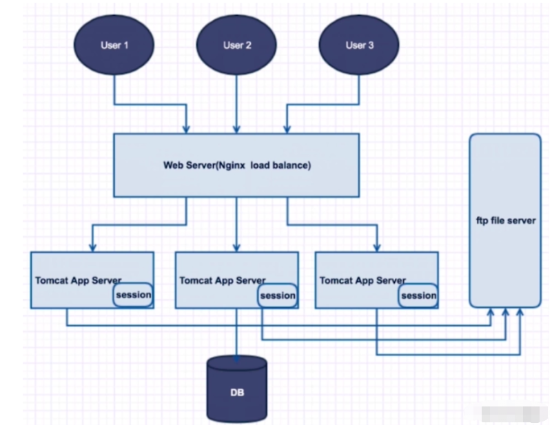

这种 ”想当然“ 的Tomcat集群会带来什么问题？？？

1. Session登录信息存储及读取的问题
2. 服务器定时任务并发的问题
3. ......

case1: 试想一下问题1这个场景，A用户通过tomcat1服务器进行登陆操作，然后进行下单，下单的业务逻辑是，必须要求登陆的用户才有权限进行下单的操作，这个时候如果下单的请求刚好呗tomcat2服务器所接受，但是tomcat2服务器上的session会话没有A用户的登陆信息，此时界面会跳转到登陆页面，强制要求A用户进行登陆。可以看到这对用户是多么差的购物体验，对于A用户来说明明刚刚登陆了，我现在要下单，你却说我没有登陆，又让我登陆，对于网站而言，本想通过部署多台服务器集群来提高网站的并发能力和吞吐量，但对用户造成了极差的购物体验，用户压根不会关心网站的架构是如何实现的。

case2: 试想一下问题2这个场景，当用户进行下单操作，但在规定的付款时间内没有完成订单的支付操作，则这样的订单就是无效的订单，系统就需要将这些订单包含的各个商品的数量更新回商品的库存，管理员进行逐个的商品库存修改是不可能完成的，于是就需要为购物系统配置一个定时关单的任务，如果在集群环境下，每个服务器上的定时关单任务都运行，在某些复杂的情况下，会造成关单失败，并且不好发现问题。


所以架构的演进并不是 ”想当然“ 的那么简单，当我们的架构随着业务的需求进行演进时，就可能会发生代码上的改动，以及其他各方面配置及机器的改动，并不是单纯的增加Tomcat机器就行了。因为架构的演进都不是一蹴而就的，编程是一个遇见问题解决问题的过程，所以我们不可能一下子就设计出一个完美的架构，而且也不存在完美的架构，只有合适的架构。

### 常见的Tomcat集群解决方案

1. 采用 nginx 中的 ip hash 解决后端session不共享问题，来保持某个ip始终连接在某一个机器上（hash(ip) % 集群数量）,这样同一个客户端只要在网络不变的情况下，总是会访问同一台服务器

- 优点 
  可以不改变现有的技术架构，直接实现横向扩展（省事）。但是缺陷也很明显，在实际的生产环境中，极少使用这种方式
- 缺点
  服务器请求（负载）不均衡，这是完全依赖 ip hash 的结果，如果多个用户ip hash后都请求同一台服务器，则其它的服务器就因为闲置，而造成负载不均衡，造成资源的浪费

  客户机ip动态变化频繁的情况下，无法进行服务，因为可能每次的ip hash都不一样，就无法始终保持只连接在同一台机器上。

2. 采用redis或memcache等nosql数据库，实现一个缓存session的服务器，当请求过来的时候，所有的Tomcat Server都统一往这个服务器里读取session信息。这是企业中比较常用的一种解决方案


## Redis分布式算法

### 传统分布式算法：效率低下

原始的做法是对缓存项的键进行哈希，将hash后的结果对缓存服务器的数量进行取模操作，通过取模后的结果，决定缓存项将会缓存在哪一台服务器上。例如一个图片选择存哪台服务器的一个过程，redis集群节点有0，1，2；hash(test.jpg) % 3 == 0/1/2
则该图片会根据取模后的值存在的redis集群的0，1，2中的某一个节点上。


CASE1: 假设现在的redis分布式有4个节点，20个数据 hash 取模后值为0-20，在redis节点中的存储分布如下

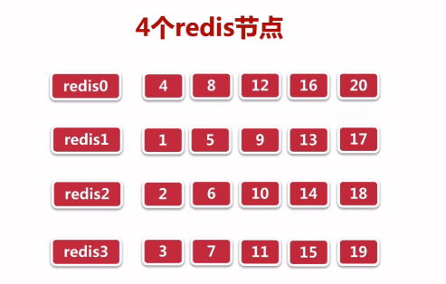

CASE2: 某一天我们的业务进行扩展了，假设现在的redis分布式有5个节点，20个数据 hash 取模后值为0-20，在redis节点中的存储分布如下

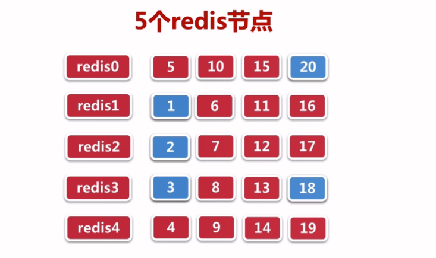

其中蓝色标记的数据：{20，1，2，3，18} 和之前在4个redis节点中的分布情况保持一致，其余15节点的分布都发生了变化。命中率仅有:(5/20) * 100% = 25%

这样Hash取模的方式是有弊端的，会导致一部分数据不能准确的在缓存服务器中找到。换句话说，当服务器数量发生变化的时候，所有缓存在一点时间内是失效的，当应用无法从缓存中获取数据时，则会向后端服务器请求数据，造成了缓存的雪崩，整个系统很有可能被压垮，所以，我们应该想办法不让这种糟糕的情况出现，但是由于Hash算法本身的缘故，使用取模法进行缓存时，这种情况是无法避免的，为了解决这些问题而出现一致性哈希算法诞生。


### 一致性哈希算法(Consistent hashing)

算法有一个环形hash空间的概念，通常hash算法都是将value映射在一个32位的key值当中，那么把数据首尾相接就会形成一个圆形，取值范围为0 ~ 2^32-1，这个圆环就是环形hash空间。

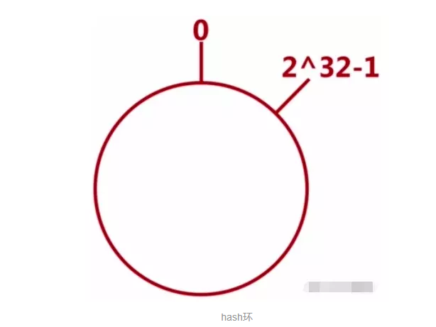<br/>

1. 我们来看如何把对象映射到环形hash空间：只考虑4个对象Object1~Object4   

首先通过hash函数计算出这四个对象的hash值key，这些对象的hash值肯定是会落在上述中的环形hash空间范围上的，对象的hash对应的环形hash空间上的哪一个key值,那么该对象就会映射到那个位置上，这样对象就映射到hash空间上


2. 同理将cache映射到环形hash空间，cache就是我们redis服务器，采用跟对象一样的hash算法。

对cache的hash计算，一般采用这个cache服务器的IP地址：hash(ip)，或者机器名：hash(name)


现在数据对象(Object1 - Object4) 和 cache(CacheA - CacheC)都通过同一个hash算法映射到这个hash环形空间中，那么接下来要考虑的就是如何将object映射到cache中


3. 数据对象如何存储在cache中？

将 key 存到顺时针方向最近的 Cache 上，即在这个环形hash空间进行一个顺时针的计算即可，例如key1顺时针遇到的第一个cache是cacheA，所以就将key1映射到cacheA中，key2顺时针遇到的第一个cache是cacheC，那么就将key2映射到cacheC中，以此类推。
因为对象和cache在hash环形空间的位置是唯一确定的，所以我们找到了数据对象映射(存储)到cache的一种方案。

4. 移除cache，object映射如何处理？

如果某一个cache被移除之后，那么object会继续沿顺时针寻找下一个cache进行映射。例如，cacheB被移除了，映射在cacheB中的object4就会顺时针往下找到cacheC，然后映射到cacheC上。

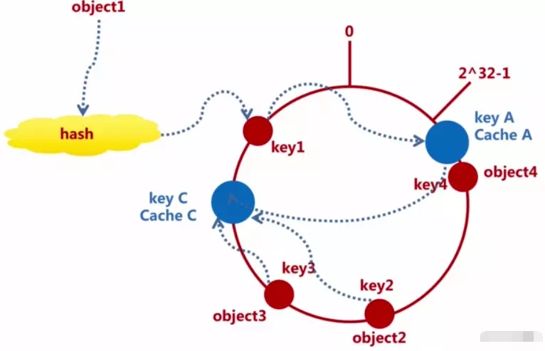<br/>


 所以当移除一个cacheB时所影响的object范围就是cacheB与cacheA之间的那一段范围，这个范围是比较小的。如下图所标出的范围：

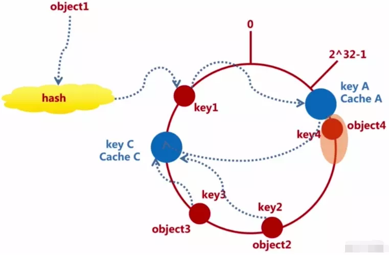<br/>

5. 添加cache，object映射如何处理？

 增加一个cache节点时也是同理，例如，在acheC和cacheB之间增加了一个cacheD节点，那么object2在顺时针遇到的第一个cache就是cacheD，此时就会将obejct2映射到cacheD中。如下图：

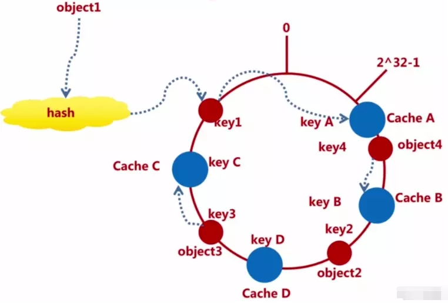<br/>

 同样的，增加cache节点所影响的范围也就是cacheD和cacheB之间的那一段范围。如下图所标出的范围：

 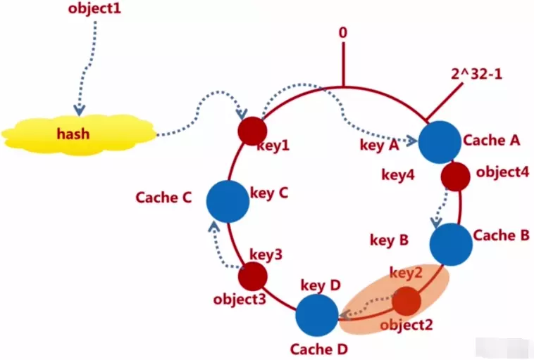<br/>


6. 总结

- 一致性哈希算法，当添加或者移除缓存节点时，对数据的存储分布范围影响较小。

当 Cache 移除或者增加，只会影响到 Cache 到上一个 Cache 的方位的 key，并不会像传统的 "hash取模算法"，牵一发而动全身（导致大量缓存不命中，请求直击DB，造成缓存穿透从而给数据库增大压力）。


#### 理想与现实的差距

做个比方，理想中学完计算机可以操作千万级的计算中心，对实际的生活找出巨大的影响（图左），现实就是图右；这就是理想与现实的差距

 <br/>

理想中的hash环形空间中Cache节点A,B,C......的分布如下图,分布的比较均匀

<br/>

现实中的hash环形空间中Cahce节点A,B,C......的分布如下图,分布的不均匀，这样大量的数据就会存储在A节点上，少量的数据才会存储在B、C节点上，这样A节点就会很忙，负载很高，而B、C就会很清闲，造成数据在分布式缓存中的分布不均匀的现象

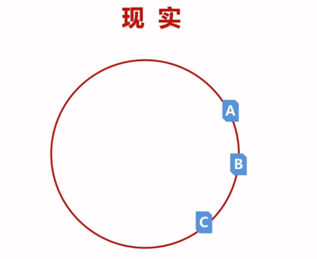<br/>

什么造成了上面的这种分布不均的现象？

这是由hash的倾斜性造成的


#### 一致性 hash 存在的问题（Hash倾斜性）

上面一致性hash算法分析的都很美好，我们假设了所有的cache节点都在环形hash空间上均匀分布，这时一种理想的状态，但是现实的情况很有可能会出现cache节点无法均匀分布在环形hash空间上。

如下图中cache节点分布不均匀的情况下，数据3，4，6，2，1都会映射(存储)在A节点上，5存储在B节点上，而C节点上没有存储任何数据，这就是Hash倾斜性所导致的现象，无法保证在环形hash空间上绝对的分布均匀。


### 一致性哈希算法解决Hash倾斜性——引入虚拟节点

#### 虚拟节点

为了解决Hash倾斜性的问题，一致性hash算法引入了虚拟节点，object不再直接映射到实际的cache节点中，而是先映射到虚拟节点中。然后虚拟节点会再进行一个hash计算，最后才映射到实际的cache节点中。所以虚拟节点就是对我们的实际节点进行一个放大，如下图：浅色为虚拟节点，深色为实际节点

<br/>


1. 数据如何通过存储到实际节点中？(进行两次hash)

先把对象hash到虚拟节点上，再将虚拟节点重新hash到真实的Cache节点上。如下图所示：例如数据对象object1 第一次hash 后映射到虚拟Cache V2上，V2再经过一次hash后映射到真实的Cache节点N1上

2. 虚拟节点也会有hash倾斜性的问题？

实际情况中，我们可以调整虚拟节点的数量，可以想象，随着虚拟节点的增多，hash环形空间上会分布着密密麻麻的虚拟节点，这样数据就会映射的比较均匀了，这样的话当添加或删除Cache节点，对原始数据的存储分布影响都会很小;

redis中引入了虚拟节点的概念，虚拟节点相当于是实际节点的一个影子或者说分身，而且虚拟节点一般都比实际节点的数量要多，可能一下多好几百倍，这个hash的环上都是密密麻麻的虚拟节点；

默认的一个实际redis节点有160个虚拟节点，如果给redis实际节点配置了权重的话（默认权重是1），那虚拟节点的个数就是权重*160。


### Consistent hashing命中率

 命中率=(1 - n /(n+m) ) * 100%   (注释：     n = 现有的节点数量；m = 新增的节点数量)

 按照上面的例子，Cache节点从4个扩充到5个，传统的hash分布式算法命中率为25%；而一致性hash算法的命中率为(1-4/5)*100% = 20%,为什么一致性hash算法的命中率更低呢？

 那是因为我们的样本数量非常小，当样本数量达到百万级别和千万级的时候，随着我们的分布式集群不断扩大的时候，即m不断变大，命中率会越来越高，即对原始的数据分布影响会越来越小


### 封装分布式Shard(分片) Redis API

#### redis分片连接池构建

当业务的数据量非常庞大时，需要考虑将数据存储到多个缓存节点上，如何定位数据应该存储的节点，一般用的是一致性哈希算法。Jedis在客户端角度实现了一致性哈希算法，对数据进行分片，存储到对应的不同的redis实例中。

```java
//基于Jedis客户端实现redis分片连接池，Jedis在客户端角度实现了一致性哈希算法，对数据进行分片，存储到对应的不同的redis实例中。
public class RedisShardedPool {
    //sharded jedis连接池
    private static ShardedJedisPool pool;
    //最大连接数
    private static Integer maxTotal = Integer.parseInt(PropertiesUtil.getProperty("redis.max.total","20"));
    //在jedispool中最大的idle状态(空闲的)的jedis实例的个数
    private static Integer maxIdle = Integer.parseInt(PropertiesUtil.getProperty("redis.max.idle","20"));
    //在jedispool中最小的idle状态(空闲的)的jedis实例的个数
    private static Integer minIdle = Integer.parseInt(PropertiesUtil.getProperty("redis.min.idle","20"));
    //在borrow一个jedis实例的时候，是否要进行验证操作，如果赋值true。则得到的jedis实例肯定是可以用的。
    private static Boolean testOnBorrow = Boolean.parseBoolean(PropertiesUtil.getProperty("redis.test.borrow","true"));
    //在return一个jedis实例的时候，是否要进行验证操作，如果赋值true。则放回jedispool的jedis实例肯定是可以用的
    private static Boolean testOnReturn = Boolean.parseBoolean(PropertiesUtil.getProperty("redis.test.return","true"));

    private static String redis1Ip = PropertiesUtil.getProperty("redis1.ip");
    private static Integer redis1Port = Integer.parseInt(PropertiesUtil.getProperty("redis1.port"));

    private static String redis2Ip = PropertiesUtil.getProperty("redis2.ip");
    private static Integer redis2Port = Integer.parseInt(PropertiesUtil.getProperty("redis2.port"));


    private static void initPool(){
        JedisPoolConfig config = new JedisPoolConfig();

        config.setMaxTotal(maxTotal);
        config.setMaxIdle(maxIdle);
        config.setMinIdle(minIdle);

        config.setTestOnBorrow(testOnBorrow);
        config.setTestOnReturn(testOnReturn);

        config.setBlockWhenExhausted(true);//连接耗尽的时候，是否阻塞，false会抛出异常，true阻塞直到超时。默认为true。

        JedisShardInfo info1 = new JedisShardInfo(redis1Ip,redis1Port,1000*2);

        JedisShardInfo info2 = new JedisShardInfo(redis2Ip,redis2Port,1000*2);

        List<JedisShardInfo> jedisShardInfoList = new ArrayList<JedisShardInfo>(2);

        jedisShardInfoList.add(info1);
        jedisShardInfoList.add(info2);

        // Redis的分片策略：MURMUR_HASH(默认，对应的就是一致性算法)、MD5
        pool = new ShardedJedisPool(config,jedisShardInfoList, Hashing.MURMUR_HASH, Sharded.DEFAULT_KEY_TAG_PATTERN);
    }

    static{
        initPool();
    }

    public static ShardedJedis getJedis(){
        return pool.getResource();
    }


    public static void returnBrokenResource(ShardedJedis jedis){
        pool.returnBrokenResource(jedis);
    }


    public static void returnResource(ShardedJedis jedis){
        pool.returnResource(jedis);
    }
}
```


### Redis分片源码解析


Jedis对Sharded的实现主要是在JedisShardInfo.java、ShardedJedis.java和ShardedJedisPool.java中。

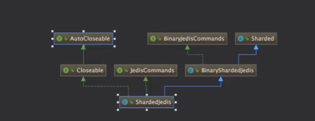


#### JedisShardInfo.java

JedisShardInfo包含了一个redis节点主机号，端口号，名称，密码等相关信息,即一个JedisShardedInfo类代表一个数据分片的主体
```java
public class JedisShardInfo extends ShardInfo<Jedis> {
    private int timeout;
    private String host;
    private int port;
    private String password;
    private String name;

    public JedisShardInfo(String host, int port, int timeout, int weight) {
        super(weight);
        this.password = null;
        this.name = null;
        this.host = host;
        this.port = port;
        this.timeout = timeout;
    }
}

```


#### ShardedJedis.java

要构造一个ShardedJedis，需提供一个或多个JedisShardInfo(分片实体),指定数据分片算法，指定分片算法所依据的key的形式


构造函数中的三个主要的参数

shards
一个JedisShardInfo的列表，一个JedisShardedInfo类代表一个数据分片的主体

algo
数据分片算法

keyTagPattern
自定义分片算法所依据的key的形式。例如，可以不针对整个key的字符串做哈希计算，而是类似对thisisa{key}中包含在大括号内的字符串进行哈希计算


```java

public class ShardedJedis extends BinaryShardedJedis implements JedisCommands, Closeable {
    protected Pool<ShardedJedis> dataSource = null;

    public ShardedJedis(List<JedisShardInfo> shards) {
        super(shards);
    }

    public ShardedJedis(List<JedisShardInfo> shards, Hashing algo) {
        super(shards, algo);
    }

    public ShardedJedis(List<JedisShardInfo> shards, Pattern keyTagPattern) {
        super(shards, keyTagPattern);
    }

    public ShardedJedis(List<JedisShardInfo> shards, Hashing algo, Pattern keyTagPattern) {
        super(shards, algo, keyTagPattern);
    }
}

```

#### ShardedJedisPool.java

分片连接池的构建需要3个参数：连接配置策略、数据分片的主体列表、数据分片算法、自定义分片算法所依据的key的形式；通过调用ShardedJedisPool对象的getResource()方法得到ShardedJedis对象

ShardedJedisPool pool = new ShardedJedisPool(config,jedisShardInfoList, Hashing.MURMUR_HASH, Sharded.DEFAULT_KEY_TAG_PATTERN);

```java
public class ShardedJedisPool extends Pool<ShardedJedis> {
    public ShardedJedisPool(GenericObjectPoolConfig poolConfig, List<JedisShardInfo> shards) {
        this(poolConfig, shards, Hashing.MURMUR_HASH);
    }

    public ShardedJedisPool(GenericObjectPoolConfig poolConfig, List<JedisShardInfo> shards, Hashing algo) {
        this(poolConfig, shards, algo, (Pattern)null);
    }

    public ShardedJedisPool(GenericObjectPoolConfig poolConfig, List<JedisShardInfo> shards, Pattern keyTagPattern) {
        this(poolConfig, shards, Hashing.MURMUR_HASH, keyTagPattern);
    }

    public ShardedJedisPool(GenericObjectPoolConfig poolConfig, List<JedisShardInfo> shards, Hashing algo, Pattern keyTagPattern) {
        super(poolConfig, new ShardedJedisPool.ShardedJedisFactory(shards, algo, keyTagPattern));
    }

    public ShardedJedis getResource() {
        ShardedJedis jedis = (ShardedJedis)super.getResource();
        jedis.setDataSource(this);
        return jedis;
    }

```


#### 哈希环的初始化(Sharded.java)

Sharded类维护了TreeMap、LinkedHashMap

TreeMap

基于红黑树实现，用来存放经过一致性哈希计算后的redis节点，

LinkedHashMap


定位的流程如下：

先在TreeMap中找到对应key所对应的ShardInfo，然后通过ShardInfo在LinkedHashMap中找到对应的Jedis实例

可以看到，它对每一个ShardInfo通过一定规则计算其哈希值，然后存到TreeMap中，这里它实现了一致性哈希算法中虚拟节点的概念，因为我们可以看到同一个ShardInfo不止一次被放到TreeMap中，数量是，权重*160。

增加了虚拟节点的一致性哈希有很多好处，比如能避免数据在redis节点间分布不均匀

然后，


```java
public class Sharded<R, S extends ShardInfo<R>> {
    public static final int DEFAULT_WEIGHT = 1;
    private TreeMap<Long, S> nodes;
    private final Hashing algo;
    private final Map<ShardInfo<R>, R> resources ;
    private Pattern tagPattern;
    public static final Pattern DEFAULT_KEY_TAG_PATTERN = Pattern.compile("\\{(.+?)\\}");

    public Sharded(List<S> shards, Hashing algo, Pattern tagPattern) {
        //用来保存ShardInfo与Jedis实例的对应关系。
        this.resources = new LinkedHashMap();
        this.tagPattern = null;
        this.algo = algo;
        this.tagPattern = tagPattern;
        this.initialize(shards);
    }
    private void initialize(List<S> shards) {
            this.nodes = new TreeMap();

            for(int i = 0; i != shards.size(); ++i) {
                S shardInfo = (ShardInfo)shards.get(i);
                int n;
                if (shardInfo.getName() == null) {
                    for(n = 0; n < 160 * shardInfo.getWeight(); ++n) {
                        this.nodes.put(this.algo.hash("SHARD-" + i + "-NODE-" + n), shardInfo);
                    }
                } else {
                    for(n = 0; n < 160 * shardInfo.getWeight(); ++n) {
                        this.nodes.put(this.algo.hash(shardInfo.getName() + "*" + shardInfo.getWeight() + n), shardInfo);
                    }
                }
                //在LinkedHashMap中放入ShardInfo以及其对应的Jedis实例，通过调用其自身的createSource()来得到jedis实例
                this.resources.put(shardInfo, shardInfo.createResource());
            }

     }

    //可以看到，先通过getShardInfo方法从TreeMap中获得对应的ShardInfo，然后根据这个ShardInfo就能够再LinkedHashMap中获得对应的Jedis实例了
    public R getShard(byte[] key) {
        return this.resources.get(this.getShardInfo(key));
    }

    public R getShard(String key) {
        return this.resources.get(this.getShardInfo(key));
    }

    public S getShardInfo(byte[] key) {
        SortedMap<Long, S> tail = this.nodes.tailMap(this.algo.hash(key));
        return tail.isEmpty() ? (ShardInfo)this.nodes.get(this.nodes.firstKey()) : (ShardInfo)tail.get(tail.firstKey());
    }

    public S getShardInfo(String key) {
        return this.getShardInfo(SafeEncoder.encode(this.getKeyTag(key)));
    }

    public String getKeyTag(String key) {
        if (this.tagPattern != null) {
            Matcher m = this.tagPattern.matcher(key);
            if (m.find()) {
                return m.group(1);
            }
        }

        return key;
    
}
```


#### 基于Redis分片连接池创建工具类

```java

public class RedisShardedPoolUtil {

    public static Long expire(String key,int exTime){
        ShardedJedis jedis = null;
        Long result = null;
        try {
            jedis = RedisShardedPool.getJedis();
            result = jedis.expire(key,exTime);
        } catch (Exception e) {
            log.error("expire key:{} error",key,e);
            RedisShardedPool.returnBrokenResource(jedis);
            return result;
        }
        RedisShardedPool.returnResource(jedis);
        return result;
    }

    //exTime的单位是秒
    public static String setEx(String key,String value,int exTime){
        ShardedJedis jedis = null;
        String result = null;
        try {
            jedis = RedisShardedPool.getJedis();
            result = jedis.setex(key,exTime,value);
        } catch (Exception e) {
            log.error("setex key:{} value:{} error",key,value,e);
            RedisShardedPool.returnBrokenResource(jedis);
            return result;
        }
        RedisShardedPool.returnResource(jedis);
        return result;
    }

    public static String set(String key,String value){
        ShardedJedis jedis = null;
        String result = null;

        try {
            jedis = RedisShardedPool.getJedis();
            result = jedis.set(key,value);
        } catch (Exception e) {
            log.error("set key:{} value:{} error",key,value,e);
            RedisShardedPool.returnBrokenResource(jedis);
            return result;
        }
        RedisShardedPool.returnResource(jedis);
        return result;
    }

    public static String getSet(String key,String value){
        ShardedJedis jedis = null;
        String result = null;

        try {
            jedis = RedisShardedPool.getJedis();
            result = jedis.getSet(key,value);
        } catch (Exception e) {
            log.error("getset key:{} value:{} error",key,value,e);
            RedisShardedPool.returnBrokenResource(jedis);
            return result;
        }
        RedisShardedPool.returnResource(jedis);
        return result;
    }

    public static String get(String key){
        ShardedJedis jedis = null;
        String result = null;
        try {
            jedis = RedisShardedPool.getJedis();
            result = jedis.get(key);
        } catch (Exception e) {
            log.error("get key:{} error",key,e);
            RedisShardedPool.returnBrokenResource(jedis);
            return result;
        }
        RedisShardedPool.returnResource(jedis);
        return result;
    }

    public static Long del(String key){
        ShardedJedis jedis = null;
        Long result = null;
        try {
            jedis = RedisShardedPool.getJedis();
            result = jedis.del(key);
        } catch (Exception e) {
            log.error("del key:{} error",key,e);
            RedisShardedPool.returnBrokenResource(jedis);
            return result;
        }
        RedisShardedPool.returnResource(jedis);
        return result;
    }

    public static Long setnx(String key,String value){
        ShardedJedis jedis = null;
        Long result = null;

        try {
            jedis = RedisShardedPool.getJedis();
            result = jedis.setnx(key,value);
        } catch (Exception e) {
            log.error("setnx key:{} value:{} error",key,value,e);
            RedisShardedPool.returnBrokenResource(jedis);
            return result;
        }
        RedisShardedPool.returnResource(jedis);
        return result;
    }

```

### 集群和分布式的区别？

集群：是一种物理形态，同一个业务，部署在多个服务器上，tomcat一般称为集群

分布式：是一种工作的方式，一个业务分拆多个子业务，部署在不同的服务器上

举例说明：

小饭店原来只有一个厨师，切菜洗菜备料炒菜全干。后来客人多了，厨房一个厨师忙不过来，又请了个厨师，两个厨师都能炒一样的菜，这两个厨师的关系是集群。

为了让厨师专心炒菜，把菜做到极致，又请了个配菜师负责切菜，备菜，备料，厨师和配菜师的关系是分布式，一个配菜师也忙不过来了，又请了个配菜师，两个配菜师关系是集群


### 单点登陆SSO（Single Sign On）的实现


- 采用Redis+Cookie+Jackson+Filter原生实现单点登陆，前提是实现session共享

实现session共享前，访问tomcat1和tomcat2上的服务，浏览器客户端对应的【Cookie: JSESSIONID=*****】值是不一样的，而且随着服务器的重启或者刷新请求，JSESSIONID的值是会更新的。
我们需要在服务端创建cookie，保存这个JSESSIONID的值，并将这个cookie返回给客户端。后续访问网站就是使用这个cookie中的value值，去redis中去查询匹配是否存在这样的值，如果存在这个用户是否已经登陆。


单点登陆接口

```java
 
public ServerResponse<User> login(String username, String password, HttpSession session, HttpServletResponse httpServletResponse) {
    ServerResponse<User> response = iUserService.login(username, password);
    if (response.isSuccess()) {
        //登陆成功，将sessionId存储在Cookie中，写回客户端
        CookieUtil.writeLoginToken(httpServletResponse,session.getId());
        //sessionId:  8FF6EDA78AB9858725B1983298610F8E
        //将sessionId作为key ，user的序列化查询结果为 value 存储在 Redis 中，{key:sessionId value:user} 过期时间REDIS_SESSION_EXTIME：30分钟
        RedisShardedPoolUtil.setEx(session.getId(), JsonUtil.obj2String(response.getData()),Const.RedisCacheExtime.REDIS_SESSION_EXTIME);
    }
    return response;
}
```


```Java
    //新建一个 Cookie ，new Cookie(COOKIE_NAME, token) ，token为sessionid
    public static void writeLoginToken(HttpServletResponse response, String token) {
        Cookie cookie = new Cookie(COOKIE_NAME, token); // COOKIE_NAME = mmall_login_token
        cookie.setDomain(COOKIE_DOMAIN); // www.happymmall.com
        cookie.setPath("/"); //代表设置在根目录，即 www.happymmall.com/
        //这样前端无法操作cookie，就无法获取cookie进行恶意的攻击
        cookie.setHttpOnly(true);
        //单位是秒。
        //如果这个maxage不设置的话，cookie就不会写入硬盘，而是写在内存。只在当前页面有效。
        cookie.setMaxAge(60 * 60 * 24 * 365); //-1代表永久
        log.info("write cookieName:{}, coo  kieValue:{}", cookie.getName(), cookie.getValue());
        response.addCookie(cookie);
    }
```

```java

/**
 * Created by oyj
 * 使用jackson工具包封装序列化工具
 */
@Slf4j
public class JsonUtil {

    private static ObjectMapper objectMapper = new ObjectMapper();
    static{

        //以下是对象转序列化字符串的设置

        //对象的所有字段全部列入
        objectMapper.setSerializationInclusion(Inclusion.ALWAYS);

        //取消默认转换timestamps形式
        objectMapper.configure(SerializationConfig.Feature.WRITE_DATES_AS_TIMESTAMPS,false);

        //忽略空Bean转json的错误
        objectMapper.configure(SerializationConfig.Feature.FAIL_ON_EMPTY_BEANS,false);

        //所有的日期格式都统一为以下的样式，即yyyy-MM-dd HH:mm:ss
        objectMapper.setDateFormat(new SimpleDateFormat(DataTimeUtil.STANDARD_FORMAT));


        //以下是序列化字符串转对象的设置

        //忽略 在json字符串中存在，但是在java对象中不存在对应属性的情况。防止错误
        objectMapper.configure(DeserializationConfig.Feature.FAIL_ON_UNKNOWN_PROPERTIES,false);
    }


    //对象序列化
    public static <T> String obj2String(T obj){
        if(obj == null){
            return null;
        }
        try {
            return obj instanceof String ? (String)obj :  objectMapper.writeValueAsString(obj);
        } catch (Exception e) {
            log.warn("Parse Object to String error",e);
            return null;
        }
    }

    //返回一个格式好的字符串
    public static <T> String obj2StringPretty(T obj){
        if(obj == null){
            return null;
        }
        try {
            return obj instanceof String ? (String)obj :  objectMapper.writerWithDefaultPrettyPrinter().writeValueAsString(obj);
        } catch (Exception e) {
            log.warn("Parse Object to String error",e);
            return null;
        }
    }


    //反序列化

    /**
     * Class<T>代表这个类型所对应的类 String.class 是Class<String> 类型的
     *
     */
    public static <T> T string2Obj(String str,Class<T> clazz){
        if(StringUtils.isEmpty(str) || clazz == null){
            return null;
        }

        try {
            return clazz.equals(String.class)? (T)str : objectMapper.readValue(str,clazz);
        } catch (Exception e) {
            log.warn("Parse String to Object error",e);
            return null;
        }
    }


    public static <T> T string2Obj(String str, TypeReference<T> typeReference){
        if(StringUtils.isEmpty(str) || typeReference == null){
            return null;
        }
        try {
            return (T)(typeReference.getType().equals(String.class)? str : objectMapper.readValue(str,typeReference));
        } catch (Exception e) {
            log.warn("Parse String to Object error",e);
            return null;
        }
    }


    public static <T> T string2Obj(String str,Class<?> collectionClass,Class<?>... elementClasses) {
        JavaType javaType = objectMapper.getTypeFactory().constructParametricType(collectionClass, elementClasses);
        try {
            return objectMapper.readValue(str, javaType);
        } catch (Exception e) {
            log.warn("Parse String to Object error", e);
            return null;
        }
    }


```

### 解决 SessionId 在多个 Tomcat 不一致问题：使用 Cookie 保存 SessionId

`private final static String COOKIE_DOMAIN = "www.happymmall.com";` 

将 Cookie 写在二级域名 happymmall.com 下，即 三级域名 xxx.happymmall.com 都能访问到这二级域名 Cookie。(以后做微服务可以把用户模块单独设置一个域，user.happymmall.com)


## 解决用户 session 过期问题（SessionExpirefilter）


**问题描述：** redis中的session是设置有过期时间的（比如30分钟），所以在后续访问系统页面时，要将redis中的session过期时间重新设置为30分钟，否者，只能玩30分钟，后续访问系统页面时，会由于redis中session过期，而不能访问。如果用户30分钟一直没有访问页面，session失效时合乎情理的，但是如果用户两次操作间隔小于30分钟，即使用比较频繁的情况下，30分钟后就要从新登陆，这样用户体验就不好了。

**解决方案：** 使用SessionExpireFilter过滤器重置session有效期。过滤所有*.do结尾的访问请求，重新设置session缓存时间，这样每次访问新的页面时，session的有效期将会从新更新为30分钟，保持用户会话的次序有效性。


```java
public class SessionExpireFilter implements Filter {

    @Override
    public void init(FilterConfig filterConfig) throws ServletException {

    }

    @Override
    public void doFilter(ServletRequest servletRequest, ServletResponse servletResponse, FilterChain filterChain) throws IOException, ServletException {
        HttpServletRequest httpServletRequest = (HttpServletRequest)servletRequest;

        String loginToken = CookieUtil.readLoginToken(httpServletRequest);

        if(StringUtils.isNotEmpty(loginToken)){
            //判断logintoken是否为空或者""；
            //如果不为空的话，符合条件，继续拿user信息
            
            String userJsonStr = RedisShardedPoolUtil.get(loginToken);
            User user = JsonUtil.string2Obj(userJsonStr,User.class);
            if(user != null){
                //如果user不为空，则重置session的时间，即调用expire命令
                RedisShardedPoolUtil.expire(loginToken, Const.RedisCacheExtime.REDIS_SESSION_EXTIME);
            }
        }
        filterChain.doFilter(servletRequest,servletResponse);
    }

    @Override
    public void destroy() {

    }
}

```

web.xml

```
<!-- 二期新增重置session时间的filter-->
    <filter>
        <filter-name>sessionExpireFilter</filter-name>
        <filter-class>com.mmall.controller.common.SessionExpireFilter</filter-class>
    </filter>
    <filter-mapping>
        <filter-name>sessionExpireFilter</filter-name>
        <url-pattern>*.do</url-pattern>
    </filter-mapping>

```

### 测试
先访问 login.do ，然后 ttl 查看剩余时间，然后随便访问一个 .do 请求（因为拦截的是所有 .do 请求，然后重置时间），再 ttl 查看，发现重置时间了，成功~！


## 集群环境下Guava Cache 迁移到 redis实现重置密码接口

### 场景
为了在用户未登录的情况下可以通过回答问题修改密码，在回答问题正确之后，后台生成Token保存到服务器，并且返回到前端，用户携带Token作为用户的标志去请求后台修改密码。

### 问题
一期项目使用的是Guava cache保存Token，如果第一次回答问题的请求在A服务器上，客户端拿到Token，此时客户端携带token去请求后台服务器修改密码，但此时连接到B服务器上，而B服务器上的Guava Cache上没有这个Token,所以密码回修改失败，这是由tomcat集群演进所产生的问题。

### 解决方法
回答问题答案正确时将token保存到redis中,修改密码的时候从redis中读取，和前端传来的token进行匹配，如果匹配成功则修改密码，否者不修改。

```Java
@Override
    public ServerResponse<String> checkAnswer(String username, String question, String answer) {
        int resultCount = userMapper.checkAnswer(username, question, answer);
        if (resultCount > 0) {
            //说明问题及问题答案是该用户的，并且是正确的
            String forgetToken = UUID.randomUUID().toString();
            // 一期：token 放入本地缓存（存在集群之后的隐患） 二期：放入 Redis 中。
            RedisShardedPoolUtil.setEx(Const.TOKEN_PREFIX + username, forgetToken,60*60*12);
            return ServerResponse.createBySuccess(forgetToken);
        }
        return ServerResponse.createByErrorMessage("问题答案错误");
    }
```

```Java
@Override
    public ServerResponse<String> forgetResetPassword(String username, String passwordNew, String forgetToken) {
        if (StringUtils.isBlank(forgetToken)) {
            ServerResponse.createByErrorMessage("参数传递错误，Token需要传递");
        }
        int resultCount = userMapper.checkUsername(username);
        if (resultCount == 0) {
            return ServerResponse.createByErrorMessage("用户名不存在");
        }

        String token = RedisShardedPoolUtil.get(Const.TOKEN_PREFIX + username);
        if (StringUtils.isBlank(token)) {
            return ServerResponse.createByErrorMessage("token无效或过期");
        }
        if (StringUtils.equals(forgetToken, token)) {
            String md5Password = MD5Util.MD5EncodeUtf8(passwordNew);
            int rowCount = userMapper.updatePasswordByUsername(username, md5Password);

            if (rowCount > 0) {
                return ServerResponse.createBySuccessMsg("修改密码成功");
            }
        } else {
            return ServerResponse.createByErrorMessage("token获取错误，请重新 获取重置密码的token");
        }
        return ServerResponse.createByErrorMessage("修改密码失败");
    }
```

## SpringSession实现单点登陆

原始的手写单点登陆方法对业务是由入侵的，如果希望减轻对业务的入侵，可采用这种方式

1. SpringSession提供了一套创建和管理Servlet、HttpSession的方案
2. 提供了集群Session的功能
3. 默认采用外置的redis来存储session数据，以此来解决session共享的问题。


在web.xml文件中添加一个session代理filter，这个filter要放在所有的filter链最前面

```xml
    <!--使用SpringSession实现单点登陆-->
    <filter>
        <filter-name>springSessionRepositoryFilter</filter-name>-->
        <filter-class>org.springframework.web.filter.DelegatingFilterProxy</filter-class>
    </filter>
    <filter-mapping>
        <filter-name>springSessionRepositoryFilter</filter-name>
        <url-pattern>*.do</url-pattern>
    </filter-mapping>
```
在applicationContext-spring-session.xml中添加如下信息

```xml
 <bean id="redisHttpSessionConfiguration" class="org.springframework.session.data.redis.config.annotation.web.http.RedisHttpSessionConfiguration">
        <property name="maxInactiveIntervalInSeconds" value="1800" />
    </bean>

    <bean id="defaultCookieSerializer" class="org.springframework.session.web.http.DefaultCookieSerializer">
        <property name="domainName" value=".happymmall.com" />
        <property name="useHttpOnlyCookie" value="true" />
        <property name="cookiePath" value="/" />
        <property name="cookieMaxAge" value="31536000" />
    </bean>

    <bean id="jedisPoolConfig" class="redis.clients.jedis.JedisPoolConfig">
        <property name="maxTotal" value="20"/>
    </bean>

    <bean id="jedisConnectionFactory" class="org.springframework.data.redis.connection.jedis.JedisConnectionFactory">
        <property name="hostName" value="127.0.0.1" />
        <property name="port" value="6379" />
        <property name="poolConfig" ref="jedisPoolConfig" />
    </bean>

```

查看jedisConnectionFactory.java源码,发现其不支持JedisShardInfo多分片策略，因此无法使用分布式redis存储session信息

```java
public class JedisConnectionFactory implements InitializingBean, DisposableBean, RedisConnectionFactory {
    private static final Log log = LogFactory.getLog(JedisConnectionFactory.class);
    private static final ExceptionTranslationStrategy EXCEPTION_TRANSLATION = new PassThroughExceptionTranslationStrategy(JedisConverters.exceptionConverter());
    private static final Method SET_TIMEOUT_METHOD;
    private static final Method GET_TIMEOUT_METHOD;
    private JedisShardInfo shardInfo;
    ...
    public JedisConnectionFactory(JedisShardInfo shardInfo) {
        this.hostName = "localhost";
        this.port = 6379;
        this.timeout = 2000;
        this.usePool = true;
        this.poolConfig = new JedisPoolConfig();
        this.dbIndex = 0;
        this.convertPipelineAndTxResults = true;
        this.shardInfo = shardInfo;
    }
}
```
使用SpringSession后的登陆代码，与一期一模一样，可见这样实现单点登陆对业务的入侵程度非常小

```java

    @RequestMapping(value = "login.do",method = RequestMethod.GET)
    @ResponseBody
    public ServerResponse<User> login(String username, String password, HttpSession session, HttpServletResponse httpServletResponse){

        ServerResponse<User> response = iUserService.login(username,password);
        if(response.isSuccess()){

            session.setAttribute(Const.CURRENT_USER,response.getData());
//            CookieUtil.writeLoginToken(httpServletResponse,session.getId());
//            RedisShardedPoolUtil.setEx(session.getId(), JsonUtil.obj2String(response.getData()),Const.RedisCacheExtime.REDIS_SESSION_EXTIME);

        }
        return response;
    }

```


## Spring Schedule 实现定时关单

### Corn表达式

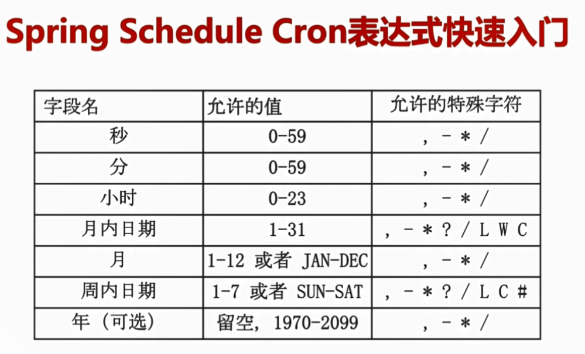

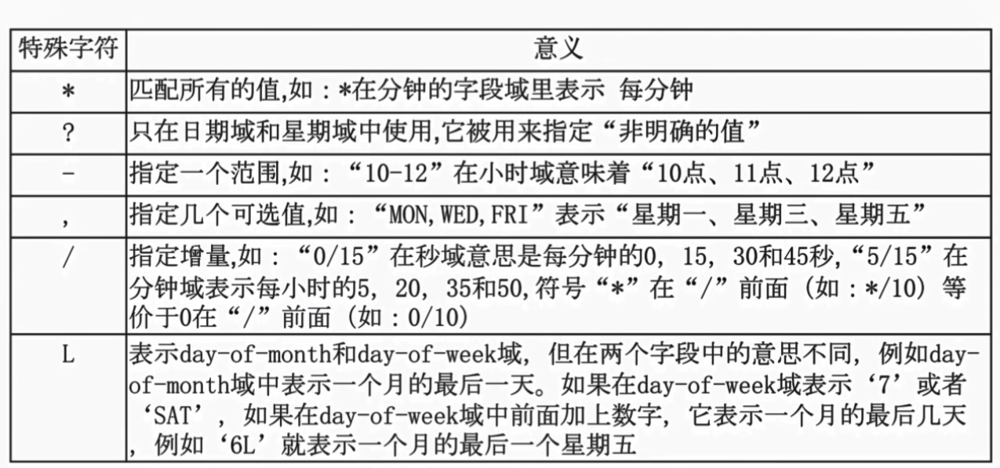

### MySQL的行、表锁

关单过程中（涉及到mysql的行锁和表锁问题），项目中关单操作采用 "悲观锁" select ...... for update

Row-Level-Lock(明确的主键：行锁) 、Table-Level-Lock(无明确的主键：表锁)

### 行锁

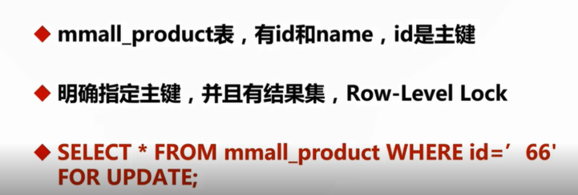

### 无锁


### 表锁

<br/>
<br/>
<br/>


### 代码实现

OrderServiceImp.java

```java
  @Override
    public void closeOrder(int hour) {
        Date dataCloseTime = DateUtils.addHours(new Date(), -hour);
        List<Order> orderList = orderMapper.selectOrderStatusByCreateTime(Const.OrderStatusEnum.NO_PAY.getCode(), DataTimeUtil.dateToStr(dataCloseTime));
        for(Order order : orderList){
            List<OrderItem> orderItemList = orderItemMapper.getByOrderNo(order.getOrderNo());
            for(OrderItem orderItem : orderItemList){

                //一定要用主键where条件，防止锁表。同时必须是支持MySQL的InnoDB
                Integer stock = productMapper.selectStockByProductId(orderItem.getProductId());

                //考虑到已生成的订单里的商品，被删除的情况，这个商品没有了，就不用更新库存了
                if(stock == null){
                    //结束本次循环
                    continue;
                }

                Product product = new Product();
                product.setId(orderItem.getProductId());
                product.setStock(stock+orderItem.getQuantity());
                //更新该商品的库存
                productMapper.updateByPrimaryKeySelective(product);
            }
            orderMapper.closeOrderByOrderId(order.getId());
            log.info("关闭订单OrderNo：{}",order.getOrderNo());
        }

    }
```

查询在date日期之前但status还是未付款状态的订单

```sql
 
  <select id="selectOrderStatusByCreateTime" resultMap="BaseResultMap" parameterType="map">
    SELECT
    <include refid="Base_Column_List"/>
    from mmall_order
    where status = #{status}
    <![CDATA[
    and create_time <= #{date}
    ]]>
    order by create_time desc
  </select>

```

查询订单的具体商品信息

```sql

  <select id="getByOrderNo" parameterType="map" resultMap="BaseResultMap">
    SELECT
    <include refid="Base_Column_List"/>
    from mmall_order_item
    where order_no = #{orderNo}
  </select>

```
查询每一个具体商品库存数量，这里用到了 "悲观锁"，在查询库存数量时，进行加锁

```sql

  <select id="selectStockByProductId" resultType="int" parameterType="java.lang.Integer">
    select
    stock
    from mmall_product
    where id = #{id}
    for update
  </select>

```

## 定时任务V1版

```java
    //每1分钟(每个1分钟的整数倍)
//    @Scheduled(cron="0 */1 * * * ?")
//    public void closeOrderTaskV1(){
//        log.info("关闭订单的定时任务  启动");
//        int hour = Integer.parseInt(PropertiesUtil.getProperty("close.order.task.time.hour","2"));
//        //对从当前时间之前 超过2个小时未支付的订单进行取消操作
//        iOrderService.closeOrder(hour);
//        log.info("关闭订单定时任务    结束");
//    }

```


## Spring Schedule + Redis 分布式锁构建分布式任务调度


## 项目的安全配置

### 无SpringMVC全局异常(不推荐)


<br/>

网站最后部署，所有人都可以访问，无springmvc全局异常时，会将系统的相关信息暴露给客户端，比如包名、数据库sql语句、IP等系统信息，这就给那些心怀不轨的攻击者带来了可乘之机，十分的危险

因此我们要对这些异常进行“包装”（使用ModelAndView进行包装）再返回给前端。

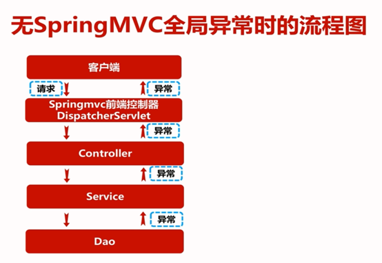<br/>


### SpringMVC全局异常(推荐采用)

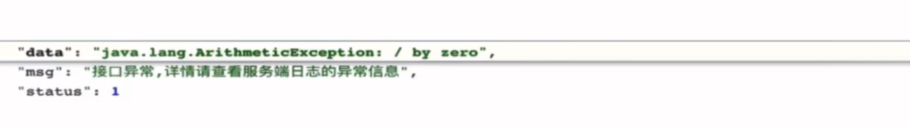<br/>

不同之处在于，当异常返回到DispatcherServlet前端控制器时，不再直接传递给前端，而是将这写异常信息传递给ExceptionResolver异常处理器，进行进一步的处理，在异常处理器中对这些异常进行 "包装"，最后将 "包装"的异常反馈给前端控制器，通过前端控制器返回给前端。这个异常对象是通过ModelAndView对象进行包装的。

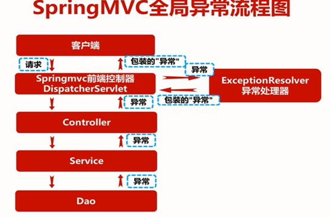<br/>


#### 包扫描隔离

**交给 springmvc 来扫描 controller**

只扫描 controller，关闭默认的扫描

Spring扫描配置文件：applicationContext.xml中排除对Controller的扫描，将处理移交给SpringMVC的扫描配置文件

```xml
    <!--Spring的配置文件，需扫描控制器以外的文件-->
    <context:component-scan base-package="com.mmall" annotation-config="true">
        <context:exclude-filter type="annotation" expression="org.springframework.stereotype.Controller" />
    </context:component-scan>

```
SpringMVC扫描配置文件：dispatcher-Servlet.xml中 use-default-filters="false" 关闭默认的全局扫描，只扫描Controller

```xml
<!-- springmvc 扫描包指定到 controller，防止重复扫描 -->
    <context:component-scan base-package="com.mmall.controller" annotation-config="true" use-default-filters="false">
        <context:include-filter type="annotation" expression="org.springframework.stereotype.Controller"/>
    </context:component-scan>
```


### 全局异常代码实现

使用ExceptionResolver.java处理全局异常，涉及到日志的处理，项目基于前后端分离，所以需要将ModelAndView转化json格式返回给前端

```java
@Slf4j
@Component
public class ExceptionResolver implements HandlerExceptionResolver{

    @Override
    public ModelAndView resolveException(HttpServletRequest httpServletRequest, HttpServletResponse httpServletResponse, Object o, Exception e) {
        //打印日志，控制台输出****路径访问异常，但具体的异常信息只有到日志文件中才可以查看
        log.error("{} Exception",httpServletRequest.getRequestURI(),e);
        ModelAndView modelAndView = new ModelAndView(new MappingJacksonJsonView());

        //当使用是jackson2.x的时候使用MappingJackson2JsonView
        modelAndView.addObject("status", ResponseCode.ERROR.getCode());
        modelAndView.addObject("msg","接口异常,详情请查看服务端日志的异常信息");
        modelAndView.addObject("data",e.toString());
        return modelAndView;
    }

}
```


## SpringMVC拦截器配置（实现后台管理员权限统一校验）

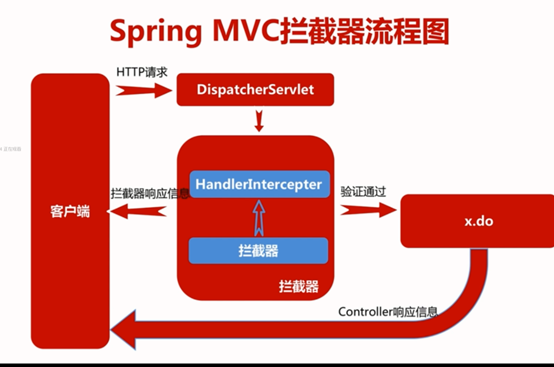<br/>

解决问题：大量的重复代码：校验用户是否登录

```xml
<mvc:interceptors>
        <!-- 定义在这里的，所有的都会拦截-->
        <mvc:interceptor>
            <mvc:mapping path="/manage/**"/>
            <bean class="com.mmall.controller.common.interceptor.AuthorityInterceptor" />
        </mvc:interceptor>
    </mvc:interceptors>
```

### 拦截器代码实现

```java
@Slf4j
public class AuthorityInterceptor implements HandlerInterceptor {

    //preHandle:进入Controller之前被调用
    @Override
    public boolean preHandle(HttpServletRequest request, HttpServletResponse response, Object handler) throws Exception {
        log.info("preHandle");
        //请求中Controller中的方法名
        HandlerMethod handlerMethod = (HandlerMethod)handler;

        //解析HandlerMethod

        String methodName = handlerMethod.getMethod().getName();
        String className = handlerMethod.getBean().getClass().getSimpleName();

        //解析参数,具体的参数key以及value是什么，我们打印日志
        StringBuffer requestParamBuffer = new StringBuffer();
        Map paramMap = request.getParameterMap();
        Iterator it = paramMap.entrySet().iterator();
        while (it.hasNext()){
            Map.Entry entry = (Map.Entry)it.next();
            String mapKey = (String)entry.getKey();

            String mapValue = StringUtils.EMPTY;

            //request这个参数的map，里面的value返回的是一个String[]
            Object obj = entry.getValue();
            if(obj instanceof String[]){
                String[] strs = (String[])obj;
                mapValue = Arrays.toString(strs);
            }
            requestParamBuffer.append(mapKey).append("=").append(mapValue);
        }

        if(StringUtils.equals(className,"UserManageController") && StringUtils.equals(methodName,"login")){
            log.info("权限拦截器拦截到请求,className:{},methodName:{}",className,methodName);
            //如果是拦截到登录请求，不打印参数，因为参数里面有密码，全部会打印到日志中，防止日志泄露
            return true;
        }

        log.info("权限拦截器拦截到请求,className:{},methodName:{},param:{}",className,methodName,requestParamBuffer.toString());


        User user = null;

        String loginToken = CookieUtil.readLoginToken(request);
        if(StringUtils.isNotEmpty(loginToken)){
            String userJsonStr = RedisShardedPoolUtil.get(loginToken);
            user = JsonUtil.string2Obj(userJsonStr, User.class);
        }

        if(user == null || (user.getRole().intValue() != Const.Role.ROLE_ADMIN)){
            //返回false.即不会调用controller里的方法
            response.reset();// 这里要添加reset，否则报异常 getWriter() has already been called for this response.
            response.setCharacterEncoding("UTF-8");//geelynote 这里要设置编码，否则会乱码
            response.setContentType("application/json;charset=UTF-8");//geelynote 这里要设置返回值的类型，因为全部是json接口。

            PrintWriter out = response.getWriter();

            //上传由于富文本的控件要求，要特殊处理返回值，这里面区分是否登录以及是否有权限
            if(user == null){
                if(StringUtils.equals(className,"ProductManageController") && StringUtils.equals(methodName,"richtextImgUpload")){
                    Map resultMap = Maps.newHashMap();
                    resultMap.put("success",false);
                    resultMap.put("msg","请登录管理员");
                    out.print(JsonUtil.obj2String(resultMap));
                }else{
                    out.print(JsonUtil.obj2String(ServerResponse.createByErrorMessage("拦截器拦截,用户未登录")));
                }
            }else{
                if(StringUtils.equals(className,"ProductManageController") && StringUtils.equals(methodName,"richtextImgUpload")){
                    Map resultMap = Maps.newHashMap();
                    resultMap.put("success",false);
                    resultMap.put("msg","无权限操作");
                    out.print(JsonUtil.obj2String(resultMap));
                }else{
                    out.print(JsonUtil.obj2String(ServerResponse.createByErrorMessage("拦截器拦截,用户无权限操作")));
                }
            }
            out.flush();
            out.close();//geelynote 这里要关闭

            return false;

        }
        return true;
    }

    //postHandle:进入Controller之后被调用
    @Override
    public void postHandle(HttpServletRequest request, HttpServletResponse response, Object handler, ModelAndView modelAndView) throws Exception {
        log.info("postHandle");
    }

    @Override
    public void afterCompletion(HttpServletRequest request, HttpServletResponse response, Object handler, Exception ex) throws Exception {
        log.info("afterCompletion");
    }
}

```


### 注意simditor富文本上传的异常处理

由于后台使用了simditor（轻量级的web富文本编辑器），对于返回值有自己的要求，所以在使用拦截器针对富文本上传controller进行权限验证时，不是管理员进行上传时，就要按照规定返回Map对象 ，不能使用项目中通用的ServerResponse封装对象。

<br/>


## 高度封装可重用的返回类

```java
/**
 * Created by geely
 */
@JsonSerialize(include =  JsonSerialize.Inclusion.NON_NULL)
//保证序列化json的时候,如果是null的对象,key也会消失
public class ServerResponse<T> implements Serializable {

    private int status;
    private String msg;
    private T data;

    private ServerResponse(int status){
        this.status = status;
    }
    private ServerResponse(int status,T data){
        this.status = status;
        this.data = data;
    }

    private ServerResponse(int status,String msg,T data){
        this.status = status;
        this.msg = msg;
        this.data = data;
    }

    private ServerResponse(int status,String msg){
        this.status = status;
        this.msg = msg;
    }

    @JsonIgnore
    //使之不在json序列化结果当中
    public boolean isSuccess(){
        return this.status == ResponseCode.SUCCESS.getCode();
    }

    public int getStatus(){
        return status;
    }
    public T getData(){
        return data;
    }
    public String getMsg(){
        return msg;
    }


    public static <T> ServerResponse<T> createBySuccess(){
        return new ServerResponse<T>(ResponseCode.SUCCESS.getCode());
    }

    public static <T> ServerResponse<T> createBySuccessMessage(String msg){
        return new ServerResponse<T>(ResponseCode.SUCCESS.getCode(),msg);
    }

    public static <T> ServerResponse<T> createBySuccess(T data){
        return new ServerResponse<T>(ResponseCode.SUCCESS.getCode(),data);
    }

    public static <T> ServerResponse<T> createBySuccess(String msg,T data){
        return new ServerResponse<T>(ResponseCode.SUCCESS.getCode(),msg,data);
    }


    public static <T> ServerResponse<T> createByError(){
        return new ServerResponse<T>(ResponseCode.ERROR.getCode(),ResponseCode.ERROR.getDesc());
    }


    public static <T> ServerResponse<T> createByErrorMessage(String errorMessage){
        return new ServerResponse<T>(ResponseCode.ERROR.getCode(),errorMessage);
    }

    public static <T> ServerResponse<T> createByErrorCodeMessage(int errorCode,String errorMessage){
        return new ServerResponse<T>(errorCode,errorMessage);
    }


}


```


